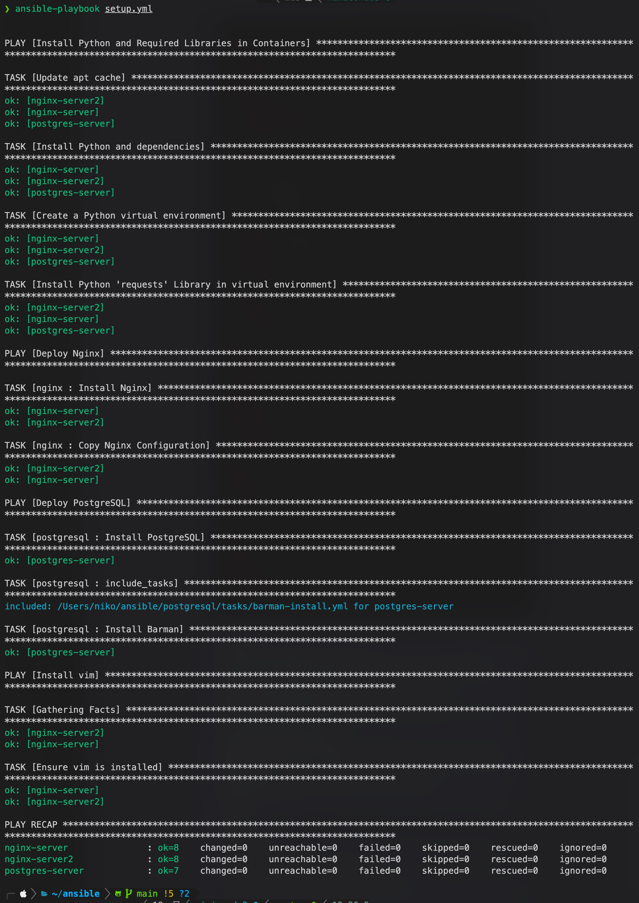

# Ansible Configuration for Web and Database Servers

| Section               | Description                                     |
|-----------------------|-------------------------------------------------|
| Project Structure     | Overview of the project's file and directory structure. |
| Requirements          | Prerequisites needed for using this project.    |
| Initial Setup         | Steps to set up the project for the first time. |
| Getting Started       | Instructions on how to start using the project. |
| Executing Playbooks   | How to run the playbooks.                       |
| Role Descriptions     | Information about the roles used in the project.|
| Security              | Security practices and usage of Ansible Vault.  |

This Ansible project demonstrates the automation of setup and configuration for Nginx web servers and PostgreSQL database servers, showcasing best practices and efficient management of web and database infrastructure.

## Executing Playbooks




## Project Structure

The project is organized as follows:

- ansible.cfg: Central configuration file for Ansible settings.
- inventory/: Directory containing hosts inventory for managing various environments.
- roles/: Contains custom roles, encapsulating tasks, templates, and variables for -  - Nginx and PostgreSQL setup.
- secret.yml: Secure storage of encrypted secrets using Ansible Vault.
- setup.yml: Primary playbook executing the defined roles and tasks.

## Requirements

- Ansible 2.9 or later.
- Docker installed on the control machine and managed nodes.
- Access to Docker daemon on managed nodes.

## Initial Setup

### Configure Docker Inventory 

Configure your Ansible inventory to match your Docker setup, as shown in the example below:

```ini
[nginx]
nginx-server ansible_connection=docker ansible_user=root ansible_python_interpreter=/opt/venv/bin/python3
nginx-server2 ansible_connection=docker ansible_user=root ansible_python_interpreter=/opt/venv/bin/python3

[postgres]
postgres-server ansible_connection=docker ansible_user=root ansible_python_interpreter=/opt/venv/bin/python3

[docker:children]
nginx
postgres
```

## Manual Docker Container Setup

To manually set up Docker containers for testing, use the following commands:

```bash
docker run --name nginx-server -p 80:80 -d nginx
docker run --name nginx-server2 -p 8080:80 -d nginx
docker run --name postgres-server -e POSTGRES_PASSWORD=example -p 5432:5432 -d postgres:13
```

## Getting started


### Clone the repository
```bash
git clone https://github.com/nikokarvinen/ansible-project.git
cd ansible
```

### Ansible vault setup:

Create or use an existing Ansible Vault password file to decrypt secret.yml:

```bash
echo [your-vault-password] > .vault_pass.txt
```
Replace [your-vault-password] with your actual vault password. This file should be kept secure and never committed to version control.

### Encrypting Sensitive Data:

Use Ansible Vault to encrypt sensitive data:
```bash
ansible-vault encrypt_string 'your_sensitive_data' --name 'variable_name'
```

### Using secret.yml with Ansible Vault

secret.yml is used to securely store encrypted variables and secrets. To use it effectively:

1. Create secret.yml:
Store sensitive data such as passwords and secret keys in secret.yml.

2. Encrypt secret.yml:
encrypt this file using:
```bash
ansible-vault encrypt secret.yml
```

3.Edit secret.yml:
To edit an encrypted secret.yml, use:
```bash
ansible-vault edit secret.yml
```

Enter your vault password to modify the file.

4. Reference in Playbooks:
```bash
Include secret.yml in your playbooks using vars_files section:
vars_files:
  - secret.yml
```

### Running Playbooks with Vault:

When running playbooks with encrypted data, Ansible will automatically use the password file .vault_pass.txt for decryption.

## Executing Playbooks

Run the playbook:

```bash
ansible-playbook setup.yml
```


### Role Descriptions

*Nginx*: Sets up Nginx servers, applying custom configurations and templates.
*PostgreSQL*: Installs PostgreSQL, handling database and user configurations.


## Security

This project uses Ansible Vault for securing sensitive data. Always encrypt your sensitive data before committing to the repository.